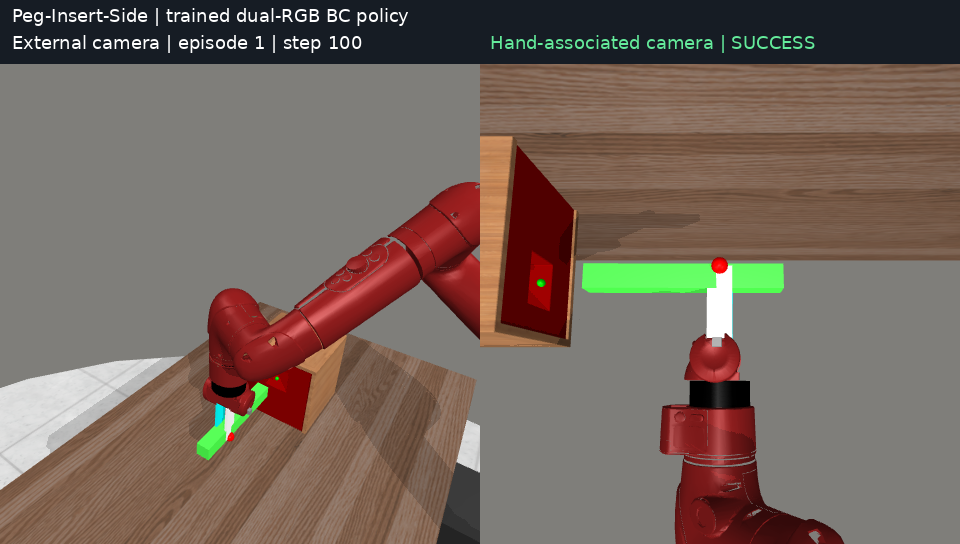

# RL-100 双 RGB 仿真实验

将 RL-100 的观测输入扩展为同步双 RGB，在 **MetaWorld Peg-Insert-Side-v2** 上完成 BC → Offline RL → Online PPO，并记录参数、实现修复、对照实验和逐 episode 评估证据。另保留早期 Adroit Door 排查脚本，以及 Peg 单 RGB / 点云对照结果。

本仓库是用户实验的整理版，**不是 RL-100 官方仓库，不是论文结果的等价复现**。基础代码来自 [Lei-Kun/RL-100](https://github.com/Lei-Kun/RL-100)，上游参考提交 `64264d952c1fda9d5096c090ddaa7177757a77ad`。实验分支在该基础上有修复和参数修改；文件指纹见 [来源记录](provenance/source_manifest.json)。



## 结论先行

- 双 RGB BC 已达到约 **94%–95%**，说明该配置能够解决任务；早期 0% 与 EMA 的 BatchNorm buffer 不同步有关，不能归结为 RGB 天然不可用。
- 原始四次 RL 运行：BC 平均 **94.25%**，验证选优的 Offline **93.25%**，验证选优的 Online **93.50%**。Online 最终 checkpoint 平均 **97.75%**，这是辅助诊断结果，不应事后替代预先约定的选优结果。
- 修复 Offline 的 Dropout 概率不一致后，两次运行最终 **97% / 92%**；没有稳定改善。修复算法正确性，不等于成功率必然提高。
- 普通 BC 续训两次最终 **98% / 98%**，优势加权续训 **98% / 99%**。目前没有证据证明多出的 0.5 个百分点来自可靠的 Q 指导。
- 不同系列使用不同测试 seed 区间；相同 BC 重评有 2–4 个百分点波动。不能把所有行混成同一严格配对实验，也不能声称双相机对单相机的提升全部由相机数量造成。

详细数据：[原始 28 个阶段](results/test_results.csv)、[后续 30 个阶段](results/test_results_v2.csv)、[后续 3,000 次 episode](results/episode_results_v2.csv)、[完整 HTML 报告](results/complete_test_report_v2.html)。下载 HTML 后用浏览器打开；GitHub 文件页通常只显示源码。

## 仓库结构

```text
rl100/rl_100/            实际运行的 RL100 核心 Python 源码快照
experiments/dual_rgb/    双视角环境、数据集、buffer、EMA、训练器和评估器
configs/historical/     历史完整 Hydra 参数；保留无效/未使用字段以供审计
scripts/run.sh          通用环境与 GPU 启动入口
scripts/train.py        BC / Offline / Offline→Online 启动入口
scripts/bootstrap_source.sh  获取固定上游版本的资产和依赖源码
scripts/check_package.py     无 GPU 的发布完整性检查
scripts/summarize_results.py  从 CSV 重新生成汇总
configs/                参数来源，实际每次运行另存 resolved config
results/                CSV、证据索引、报告
provenance/             源码指纹、环境包版本、发布验证
archive/                历史诊断/编排脚本，.txt 后缀防止误执行
```

不上传训练数据、模型权重、MuJoCo 二进制、R3M 权重、第三方虚拟环境和日志。数据可以重新采集；已有 checkpoint 需另行提供。仅凭本仓库不能直接重评旧 checkpoint 的精确分数。

## 模型与数据

每个时间点同时渲染 `corner2` 与 `behindGripper`，两幅 `3×84×84` RGB 加 9 维机器人状态。输入最近两帧，RGB resize 到 224×224，共享 R3M ResNet18 编码器，特征拼接后输入 diffusion SkipNet 动作网络。总参数约 13.30M，其中视觉编码器约 11.18M。

动作 4 维；数据窗口 horizon=5，观测 2 帧，`no_pre_action=true`，输出并执行 4 步动作，10 次去噪。`behindGripper` 是仿真手部相关相机，XML 的 `track` 行为未被证明与真实刚性腕部安装完全等价。

Actor 不读取点云或 39 维仿真 full_state。Full state 仅用于 scripted expert 和诊断；继承的环境 wrapper 内部仍会生成点云，避免把“纯 RGB 输入”误解为整个渲染链从未生成深度。

采集 107 次尝试，保留 100 条成功轨迹，每条 200 timestep，共 20,000 transitions。固定 90 条训练 / 10 条数据验证（18,000 / 2,000 transitions）；归一化只拟合训练分区。四个采集分片从 seed 10000、20000、30000、40000 开始。成功指 episode 内至少一次环境 success=True，不要求每个 timestep 都成功。

## 训练参数与计数

完整字段见 [历史主配置](configs/historical/dual_rgb_rl_full_100.yaml)；解释见 [参数说明](docs/PARAMETERS.md)。以下是实际生效的关键值：

- **BC**：batch=128 个序列窗口，250 epochs，约 141 batches/epoch；AdamW lr=2e-4、cosine、warmup=500、weight decay=1e-6。EMA buffer 修复后，历史运行从 epoch 151 续训，验证选中 epoch 200。
- **Offline critic**：IQL Q/V 100 epochs，双 Q、3 层×512、expectile=0.7、gamma=0.99、Q/V lr=1e-4、tau=0.005，冻结视觉 encoder。
- **Dynamics**：7 个 ensemble / 5 个 elite、4 层×400、batch=128、lr=3e-4、最多约 100 epochs、patience=10。
- **Offline BPPO**：2,000 外层迭代，每次实际抽 128 个窗口，10 次去噪分别更新 actor，约 20,000 actor optimizer steps；lr=5e-6 线性下降，clip=0.25，grad clip=0.5。`bppo_batch_size=512` 并非实际采样 batch，实际是 `finetune_batch_size=128`。不能把这里的 2,000 称为 dataset epochs。
- **Online PPO**：4 个并行环境、1,000,000 次真实环境交互；每轮 512 个四步 chunk=2,048 transitions，minibatch=128 chunks，K=3，10 次去噪。完整轮约 120 次 actor 更新、12 次 value 更新；488 个完整轮，最后 576 transitions 不构成完整 batch。Actor lr=3e-6、value lr=3e-4、gamma=.99、lambda=.95、clip=.2。

Episode 最长 200 timestep。一个训练 batch 的窗口彼此可重叠，也可跨不同 episode；128 个五步窗口不是 640 条独立数据。Online 的 128 chunk minibatch 对应 512 个 primitive transitions；不要与 Offline batch 混用。

## 安装与运行

详细依赖和复现边界见 [安装说明](docs/INSTALL.md)。已测试环境是 Linux、Python 3.8.20、PyTorch 2.4.0+cu121、旧版 MetaWorld / mujoco-py 2.1.2.14。不能直接换为新版 `pip install metaworld` 并期待同一环境。

```bash
# 激活依赖已安装的 rl100 环境
conda activate rl100
export PYTHON=python
bash scripts/bootstrap_source.sh
python scripts/check_package.py
GPU_ID=0 bash scripts/run.sh tests/test_semantics.py

# 采集同一状态的两路图像，每个 shard 25 条成功 episode
for shard in 0 1 2 3; do
  GPU_ID=0 bash scripts/run.sh experiments/dual_rgb/collect.py --shard "$shard" --count 25 --gain 20
done
GPU_ID=0 bash scripts/run.sh experiments/dual_rgb/prepare.py

# 建议先 smoke；使用独立 run，绝不覆盖正式输出
GPU_ID=0 bash scripts/run.sh scripts/train.py bc --run runs/bc_smoke --smoke
GPU_ID=0 bash scripts/run.sh scripts/train.py bc --seed 100 --run runs/bc100

# 指向验证选出的 BC checkpoint（路径以实际输出为准）
BC_CHECKPOINT=/absolute/path/to/validation-selected.ckpt
GPU_ID=0 bash scripts/run.sh scripts/train.py offline --seed 100 \
  --bc-checkpoint "$BC_CHECKPOINT" --run runs/offline100

# 该命令从 BC 开始，依次执行 critic/dynamics、Offline、Online
GPU_ID=0 bash scripts/run.sh scripts/train.py full --seed 100 \
  --bc-checkpoint "$BC_CHECKPOINT" --run runs/full100

# Offline 只评估存在的三个阶段；full 可不指定 EVAL_STAGES
EVAL_STAGES=bc,offline_selected,offline_last GPU_ID=0 \
  bash scripts/run.sh experiments/dual_rgb/evaluate_stages.py runs/offline100
GPU_ID=0 bash scripts/run.sh experiments/dual_rgb/evaluate_stages.py runs/full100
python scripts/summarize_results.py
```

`GPU_ID` 是物理 GPU 编号；默认 0，运行前用 `nvidia-smi` 确认可用。程序不会停止他人进程、自动抢占 GPU 或批量启动训练。对容器/MIG 必须单独验证 EGL 设备映射。

新入口默认使用修复后的 EMA、Offline Dropout 和 **50 次验证**。这些是改进后的新实验配置，不能标记为历史结果的逐位复现。`--historical-dropout --eval-episodes 20` 可保留历史 BPPO 行为用于对照；不建议作为生产默认。历史阶段的普通 BC 与优势加权续训脚本及全部诊断脚本保留于 archive，包含原运行目录约定，需适配后使用。

## 评估与问题分析

验证选优是在固定 validation 环境 seed 上比较 checkpoint，选好后再执行 held-out 测试。数据集中的 10 条 validation demonstrations 与环境 rollout 验证不是一回事。`test_mean_score` 是上游字段名，训练期间实际承担验证用途；它不意味着独立测试集。

原始验证仅 20 episodes，BC 已常达 20/20，且 best 更新要求严格更好，容易把初始 BC 保留为 best。50 次可提高分辨率到 2%，但在高成功率区间仍不足以稳定区分 1–2 个百分点。测试数据不得反向用于 checkpoint 选择。

[深入分析与修复记录](docs/ANALYSIS.md) 包含 EMA、Dropout、timeout/bootstrap、动作 chunk、critic 排序、渲染重复性和统计限制。优先顺序：固定评估随机性与渲染状态 → 强普通 BC 续训对照 → 相同预算比较 BC→Online 与 BC→Offline→Online → 增加失败/恢复数据 → 再评估更强视觉模型或新算法。

QGF 是另一个进行中的迁移实验，不计入本仓库已完成的 RL100 成绩。

## 复现状态、来源与许可

发布检查记录见 [VALIDATION](docs/VALIDATION.md)。整理版经过静态与环境语义检查；尚未在全新机器上重新完成所有长训练，不承诺复现完全相同的随机轨迹或分数。

基础源码按上游 Apache-2.0 许可证分发，保留 [LICENSE](LICENSE) / [NOTICE](NOTICE)。MetaWorld、R3M、MuJoCo、PyTorch3D 等依赖各自保留原许可。论文参考：[RL-100 项目](https://lei-kun.github.io/RL-100/)、[arXiv:2510.14830](https://arxiv.org/abs/2510.14830)。历史实验参考的是用户提供的 v4；本仓库不会把后续上游主分支新功能冒充为本次已测能力。
